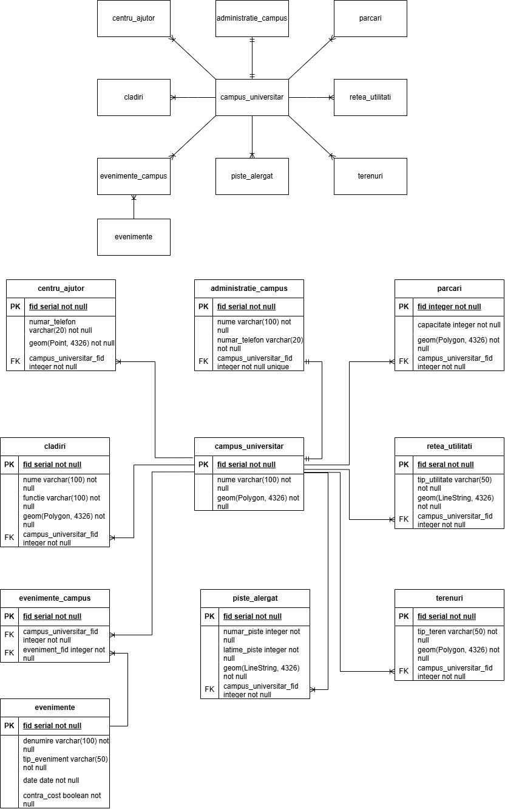

** Descrierea proiectului **

Un campus universitar pentru a funcționa eficient și organizat este alcătuit din mai multe componente esențiale, cum ar fi clădirile, fiecare cu un scop bine definit, fie că sunt săli de curs, laboratoare, cămine, cantine sau birouri administrative, toate contribuie la buna desfășurare a activităților academice și administrative. Terenurile sunt amenajate pentru sport și recreere, oferind studenților spații deschise pentru mișcare și relaxare. Pistele de alergat sunt concepute pentru activitate fizică în aer liber, indiferent de condițiile meteo, fiind parte dintr-un stil de viață sănătos în campus. Pentru o funcționare tehnică corectă, o rețea de utilități deservește întregul ansamblu cuprinzând alimentare cu apă, canalizare și alte resurse necesare clădirilor. Parcările asigură acces facil pentru studenți, profesori și vizitatori. În sprijinul comunității universitare, funcționează și centre de ajutor, unde se poate oferi suport informațional, consiliere sau prim-ajutor în situații neprevăzute. Fiecare campus este coordonat de o administrație, care gestionează întreaga activitate logistică și organizatorică. De asemenea, în cadrul campusului au loc periodic evenimente universitare, cum ar fi conferințe, târguri educaționale sau activități culturale, toate fiind gestionate eficient printr-un sistem relațional, capabil să redea interacțiunile dintre spații și activități.

Entități: campus_universitar, administratie_campus, centru_ajutor, cladiri, piste_alergat, terenuri, retea_utilitati, parcari, evenimente, evenimente_campus 

